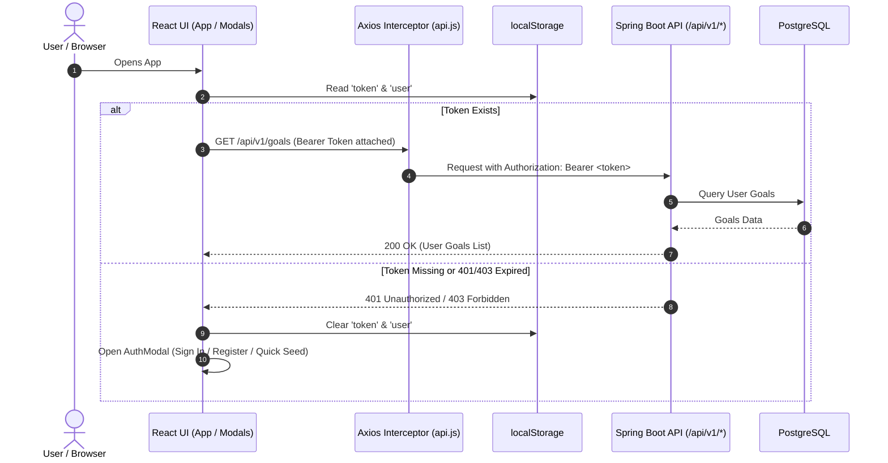

# The Winter Ark (OneGoal) — Frontend User Manual & API Flow Specification

> **Application Overview**: **The Winter Ark** (also branded as **OneGoal Accountability**) is a habit-tracking and discipline accountability Progressive Web Application (PWA). It features real-time daily task logging, progress visualization, 7/30-day analytics charts, squad accountability with live Web Push nudges, and social achievement sharing.
>
> **Frontend Stack**: React 19, Vite, Tailwind CSS v4, Axios, Recharts, Lucide Icons, html2canvas, Vite PWA (Service Worker PushManager).  
> **Backend Integration**: Spring Boot REST API (`http://localhost:8080` / `VITE_API_BASE_URL`), PostgreSQL Database, VAPID Web Push Protocol.

---

## Table of Contents

1. [Architecture & Authentication Lifecycle](#1-architecture--authentication-lifecycle)
2. [End-to-End User Flow & Navigation Map](#2-end-to-end-user-flow--navigation-map)
3. [Screen-by-Screen & Button Action Mapping](#3-screen-by-screen--button-action-mapping)
   - [3.1 Authentication & Database Setup Modal](#31-authentication--database-setup-modal)
   - [3.2 Screen 1: Daily Checklist & Dashboard (Main)](#32-screen-1-daily-checklist--dashboard-main)
   - [3.3 Create New Goal Modal](#33-create-new-goal-modal)
   - [3.4 Ad-Hoc Task Creation Modal](#34-ad-hoc-task-creation-modal)
   - [3.5 100% Completion & Social Share Modal](#35-100-completion--social-share-modal)
   - [3.6 Screen 2: Performance Analytics](#36-screen-2-performance-analytics)
   - [3.7 Screen 3: Social Squad & Accountability](#37-screen-3-social-squad--accountability)
4. [Master API Endpoints Reference](#4-master-api-endpoints-reference)
   - [Auth Endpoints](#auth-endpoints)
   - [Goal & Predefined Task Endpoints](#goal--predefined-task-endpoints)
   - [Daily Log & Task Action Endpoints](#daily-log--task-action-endpoints)
   - [Analytics Endpoints](#analytics-endpoints)
   - [Social & Nudge Endpoints](#social--nudge-endpoints)
   - [Web Push Notification Endpoints](#web-push-notification-endpoints)
5. [Data Payloads & Schemas](#5-data-payloads--schemas)
6. [Offline, Error Handling & Optimistic Updates](#6-offline-error-handling--optimistic-updates)

---

## 1. Architecture & Authentication Lifecycle

### Token & Session Lifecycle


- **Interceptor**: Every outgoing Axios request in `src/services/api.js` is automatically intercepted to attach `Authorization: Bearer <token>` if a token is present in `localStorage`.
- **Session Eviction**: If any protected request returns HTTP status `401` or `403`, the token and user data are cleared from `localStorage`, and `AuthModal` is triggered.

---

## 2. End-to-End User Flow & Navigation Map

```mermaid
flowchart TD
    Start([Launch App]) --> CheckAuth{Logged In?}
    CheckAuth -- No --> AuthScreen[AuthModal: Register / Sign In / 1-Click Setup]
    AuthScreen -->|POST /api/v1/auth/*| AuthSuccess[Auth Success -> Save Token]
    CheckAuth -- Yes --> LoadGoals[GET /api/v1/goals]
    AuthSuccess --> LoadGoals

    LoadGoals --> HasGoals{Goals Exist?}
    HasGoals -- No --> AutoSeed[POST /api/v1/goals + Add Predefined Tasks]
    AutoSeed --> MainDashboard[Checklist Screen / Dashboard]
    HasGoals -- Yes --> MainDashboard

    subgraph Bottom Navigation Tabs
        MainDashboard <-->|Tab: Analytics| AnalyticsTab[Performance Analytics Screen]
        MainDashboard <-->|Tab: Squad| FriendsTab[Squad & Friends Screen]
        AnalyticsTab <-->|Tab: Squad| FriendsTab
    end

    subgraph Dashboard Interactions
        MainDashboard -->|Date Nav Arrows| FetchDateLog[GET /api/v1/goals/:id/logs?date=YYYY-MM-DD]
        MainDashboard -->|Toggle Task Checkbox| ToggleTask[PATCH /api/v1/tasks/:id/toggle]
        MainDashboard -->|FAB (+) Button| AddAdHoc[POST /api/v1/logs/:id/tasks/ad-hoc]
        MainDashboard -->|'+ New Goal' Button| CreateGoal[POST /api/v1/goals]
        MainDashboard -->|Bell Icon| EnablePush[POST /api/v1/notifications/subscribe]
        ToggleTask -->|All Tasks Complete 100%| ShareModal[Social Share Card Modal]
    end

    subgraph Analytics Interactions
        AnalyticsTab -->|Toggle 7D / 30D Filter| FetchStats[GET /api/v1/goals/:id/stats?days=N]
    end

    subgraph Squad Interactions
        FriendsTab -->|Click 'Nudge' on Lagging Friend| RemindFriend[POST /api/v1/goals/:id/remind/:friendId]
        RemindFriend --> PushDispatched[Dispatches Live WebPush Notification]
    end
```

---

## 3. Screen-by-Screen & Button Action Mapping

### 3.1 Authentication & Database Setup Modal
*Component: `src/components/AuthModal.jsx`*

This modal is displayed when the user is unauthenticated or when the "Account" button is clicked.

| UI Element / Button | Action / Trigger | Network Call & Method | Endpoint | Payload / Params |
| :--- | :--- | :--- | :--- | :--- |
| **"Create Account" Button** | Submits registration form (when in Register mode) | `POST` | `/api/v1/auth/register` | `{ "username": "...", "email": "...", "password": "..." }` |
| **"Sign In" Button** | Submits login form (when in Login mode) | `POST` | `/api/v1/auth/login` | `{ "username": "...", "password": "..." }` |
| **"One-Click Live Backend Setup" Button** | Auto-generates user, registers, creates default goal, attaches 4 predefined tasks, and initializes today's log in PostgreSQL | Sequence: <br>1. `POST`<br>2. `POST`<br>3. `POST` x4<br>4. `GET` | 1. `/api/v1/auth/register`<br>2. `/api/v1/goals`<br>3. `/api/v1/goals/{id}/predefined-tasks`<br>4. `/api/v1/goals/{id}/logs?date=YYYY-MM-DD` | 1. Random user credentials<br>2. `{ title: "Winter Ark 90-Day Challenge" }`<br>3. `{ taskContent: "..." }`<br>4. Date query param |
| **"Already have an account? Sign In" / "Register" Link** | Toggles modal mode between Login and Register | *None (Local UI State)* | *None* | `isLogin: boolean` |

---

### 3.2 Screen 1: Daily Checklist & Dashboard (Main)
*Component: `src/components/Dashboard.jsx` & `src/App.jsx`*

The central hub displaying today's progress, circular gauge, interactive checklist, and quick navigation.

| UI Element / Button | Action / Trigger | Network Call & Method | Endpoint | Payload / Params |
| :--- | :--- | :--- | :--- | :--- |
| **Initial Screen Mount / Goal Change** | Loads active goal's daily log and tasks for selected date | `GET` | `/api/v1/goals/{goalId}/logs` | Query: `?date=YYYY-MM-DD` |
| **Account / Sign In Button** (`User` icon in top bar) | Opens the `AuthModal` | *None (Local UI State)* | *None* | `isAuthOpen: true` |
| **Web Push Bell Icon Button** (`Bell` icon in top bar) | Requests browser notification permission, generates VAPID subscription, and registers device | `POST` | `/api/v1/notifications/subscribe` | Body: `{ endpoint: "...", keys: { p256dh: "...", auth: "..." } }` |
| **Goal Switcher Dropdown** (`<select>`) | Switches the current `activeGoal` | `GET` (Triggers task reload for new goal) | `/api/v1/goals/{selectedGoalId}/logs` | Query: `?date=YYYY-MM-DD` |
| **"+ New Goal" Button** | Opens the Create New Goal modal | *None (Local UI State)* | *None* | `showCreateGoalModal: true` |
| **Date Left Arrow (`<`) / Right Arrow (`>`)** | Shifts `selectedDate` by -1 or +1 day | `GET` | `/api/v1/goals/{goalId}/logs` | Query: `?date=YYYY-MM-DD` |
| **Task Checkbox / Task Row Click** | Toggles task completion status (Optimistic UI update) | `PATCH` | `/api/v1/tasks/{taskId}/toggle` | Body: `{ "isCompleted": true / false }` |
| **"Share Card" Button** (Visible at 100% progress) | Opens the `SocialShareModal` with achievement card | *None (Local UI State)* | *None* | `showShareModal: true` |
| **Floating Action Button (FAB `+`)** | Opens the Ad-Hoc Task modal | *None (Local UI State)* | *None* | `showAddModal: true` |

---

### 3.3 Create New Goal Modal
*Component: `src/components/Dashboard.jsx` (Create Goal Sub-view)*

| UI Element / Button | Action / Trigger | Network Call & Method | Endpoint | Payload / Params |
| :--- | :--- | :--- | :--- | :--- |
| **"Create Goal" Button** | Creates new goal in PostgreSQL and attaches 3 default starter tasks | Sequence: <br>1. `POST`<br>2. `POST` x3 | 1. `/api/v1/goals`<br>2. `/api/v1/goals/{goalId}/predefined-tasks` | 1. `{ "title": newGoalTitle }`<br>2. `{ "taskContent": "..." }` |
| **"Cancel" Button** | Closes the modal without saving | *None (Local UI State)* | *None* | `showCreateGoalModal: false` |

---

### 3.4 Ad-Hoc Task Creation Modal
*Component: `src/components/Dashboard.jsx` (Ad-Hoc Sub-view)*

| UI Element / Button | Action / Trigger | Network Call & Method | Endpoint | Payload / Params |
| :--- | :--- | :--- | :--- | :--- |
| **"Save to DB" Button** | Appends a custom ad-hoc task directly into the active daily log | `POST` | `/api/v1/logs/{logId}/tasks/ad-hoc` | Body: `{ "taskContent": adHocContent }` |
| **"Cancel" Button** | Discards input and closes the modal | *None (Local UI State)* | *None* | `showAddModal: false` |

---

### 3.5 100% Completion & Social Share Modal
*Component: `src/components/SocialShareModal.jsx`*

Triggered automatically when all tasks for the day are marked complete, or via the "Share Card" button.

| UI Element / Button | Action / Trigger | Network Call & Method | Details & Behavior |
| :--- | :--- | :--- | :--- |
| **"Share to Instagram / WhatsApp" Button** | Captures `#captureCard` via `html2canvas` and triggers Web Share API | *Browser Native API* (`navigator.share`) | Generates PNG File `winterark-achievement-{date}.png` and shares natively. Falls back to direct image download. |
| **"Save Image" Button** | Captures card canvas as PNG and downloads to device | *Browser DOM Download* | Downloads `onegoal-completed-{date}.png`. |
| **"Copy Summary" Button** | Copies text summary and streak count to system clipboard | *Browser Clipboard API* (`navigator.clipboard.writeText`) | Copies: `🎯 OneGoal Daily Achievement: 100% Completed on {date}!...` |
| **Close (`X`) Button** | Closes share modal | *None (Local UI State)* | `onClose()` |

---

### 3.6 Screen 2: Performance Analytics
*Component: `src/components/Analytics.jsx`*

Visualizes habit consistency, historical completion percentages, and aggregate KPIs.

| UI Element / Button | Action / Trigger | Network Call & Method | Endpoint | Payload / Params |
| :--- | :--- | :--- | :--- | :--- |
| **Tab Switch / Goal Selection Mount** | Loads completion statistics for the default 30-day window | `GET` | `/api/v1/goals/{goalId}/stats` | Query: `?days=30` |
| **"7D" Timeframe Filter Button** | Re-queries backend stats for a 7-day rolling window | `GET` | `/api/v1/goals/{goalId}/stats` | Query: `?days=7` |
| **"30D" Timeframe Filter Button** | Re-queries backend stats for a 30-day rolling window | `GET` | `/api/v1/goals/{goalId}/stats` | Query: `?days=30` |

**Calculated KPIs on Screen**:
- **Avg Rate**: Average completion percentage across all logged days within the window.
- **Logged Days**: Total distinct days with activity recorded in PostgreSQL.
- **100% Days**: Count of days where all tasks were crushed (100% completion).
- **PostgreSQL Completion Trend**: Interactive Recharts `<AreaChart>` with custom tooltips.

---

### 3.7 Screen 3: Social Squad & Accountability
*Component: `src/components/Friends.jsx`*

Displays peer progress, streaks, and enables real-time peer nudging via Web Push.

| UI Element / Button | Action / Trigger | Network Call & Method | Endpoint | Payload / Params |
| :--- | :--- | :--- | :--- | :--- |
| **Screen Mount** | Displays squad partners, their active goals, streaks, and progress | *Pre-configured Squad State + Optional Friend Goals API* | Optional: `GET /api/v1/friends/{friendId}/goals` | Path: `friendId` |
| **"Nudge" Button** (Active for lagging friends < 100%) | Dispatches an instantaneous Web Push notification to friend's device | `POST` | `/api/v1/goals/{goalId}/remind/{friendId}` | Path: `goalId`, `friendId` |

---

## 4. Master API Endpoints Reference

### Auth Endpoints

#### 1. User Registration
- **Route**: `POST /api/v1/auth/register`
- **Trigger**: AuthModal registration form submit / One-click setup button.
- **Headers**: `Content-Type: application/json`
- **Request Body**:
  ```json
  {
    "username": "winter_warrior",
    "email": "warrior@winterark.com",
    "password": "password123"
  }
  ```
- **Response (200 OK)**:
  ```json
  {
    "token": "eyJhbGciOiJIUzI1NiIsInR5cCI6IkpXVCJ9...",
    "id": "11111111-1111-1111-1111-111111111111",
    "username": "winter_warrior"
  }
  ```

#### 2. User Login
- **Route**: `POST /api/v1/auth/login`
- **Trigger**: AuthModal login form submit.
- **Headers**: `Content-Type: application/json`
- **Request Body**:
  ```json
  {
    "username": "winter_warrior",
    "password": "password123"
  }
  ```
- **Response (200 OK)**:
  ```json
  {
    "token": "eyJhbGciOiJIUzI1NiIsInR5cCI6IkpXVCJ9...",
    "id": "11111111-1111-1111-1111-111111111111",
    "username": "winter_warrior"
  }
  ```

---

### Goal & Predefined Task Endpoints

#### 3. Fetch User Goals
- **Route**: `GET /api/v1/goals`
- **Trigger**: App initialization (`loadUserGoals`) and after login/register.
- **Headers**: `Authorization: Bearer <token>`
- **Response (200 OK)**:
  ```json
  [
    {
      "id": "aaaaaaaa-aaaa-aaaa-aaaa-aaaaaaaaaaaa",
      "title": "Winter Ark 90-Day Challenge",
      "tagLine": "Forged in discipline and cold sweat",
      "createdAt": "2026-09-01T00:00:00Z"
    }
  ]
  ```

#### 4. Create New Goal
- **Route**: `POST /api/v1/goals`
- **Trigger**: "+ New Goal" modal submission / Auto-provisioning when user has 0 goals.
- **Headers**: `Authorization: Bearer <token>`, `Content-Type: application/json`
- **Request Body**:
  ```json
  {
    "title": "Winter Discipline 2026",
    "tagLine": "Forged in discipline"
  }
  ```
- **Response (201 Created / 200 OK)**:
  ```json
  {
    "id": "bbbbbbbb-bbbb-bbbb-bbbb-bbbbbbbbbbbb",
    "title": "Winter Discipline 2026",
    "tagLine": "Forged in discipline"
  }
  ```

#### 5. Add Predefined Task to Goal
- **Route**: `POST /api/v1/goals/{goalId}/predefined-tasks`
- **Trigger**: Called immediately following goal creation to populate recurring habits.
- **Headers**: `Authorization: Bearer <token>`, `Content-Type: application/json`
- **Path Parameter**: `goalId` (UUID)
- **Request Body**:
  ```json
  {
    "taskContent": "60 Min Winter Morning Workout"
  }
  ```
- **Response (201 Created / 200 OK)**:
  ```json
  {
    "id": "cccccccc-cccc-cccc-cccc-cccccccccccc",
    "goalId": "bbbbbbbb-bbbb-bbbb-bbbb-bbbbbbbbbbbb",
    "taskContent": "60 Min Winter Morning Workout"
  }
  ```

---

### Daily Log & Task Action Endpoints

#### 6. Get Daily Log for Goal and Date
- **Route**: `GET /api/v1/goals/{goalId}/logs?date={YYYY-MM-DD}`
- **Trigger**: Dashboard mount, date selector arrows (`<` / `>`), or active goal selection change.
- **Headers**: `Authorization: Bearer <token>`
- **Query Parameter**: `date` (e.g. `2026-09-01`)
- **Response (200 OK)**:
  ```json
  {
    "logId": "dddddddd-dddd-dddd-dddd-dddddddddddd",
    "goalId": "aaaaaaaa-aaaa-aaaa-aaaa-aaaaaaaaaaaa",
    "date": "2026-09-01",
    "tasks": [
      {
        "taskId": "task-uuid-1",
        "taskContent": "60 Min Winter Morning Workout",
        "isCompleted": true,
        "isAdHoc": false
      },
      {
        "taskId": "task-uuid-2",
        "taskContent": "Read 20 pages of Systems Architecture",
        "isCompleted": false,
        "isAdHoc": false
      },
      {
        "taskId": "task-uuid-3",
        "taskContent": "5km Evening Trail Run",
        "isCompleted": false,
        "isAdHoc": true
      }
    ]
  }
  ```

#### 7. Toggle Task Completion Status
- **Route**: `PATCH /api/v1/tasks/{taskId}/toggle`
- **Trigger**: Clicking any task row or checkbox on the Checklist tab.
- **Headers**: `Authorization: Bearer <token>`, `Content-Type: application/json`
- **Path Parameter**: `taskId` (UUID)
- **Request Body**:
  ```json
  {
    "isCompleted": true
  }
  ```
- **Response (200 OK)**:
  ```json
  {
    "taskId": "task-uuid-1",
    "isCompleted": true
  }
  ```

#### 8. Add Ad-Hoc Task to Daily Log
- **Route**: `POST /api/v1/logs/{logId}/tasks/ad-hoc`
- **Trigger**: Floating Action Button (`+`) -> Ad-Hoc Task Modal submit.
- **Headers**: `Authorization: Bearer <token>`, `Content-Type: application/json`
- **Path Parameter**: `logId` (UUID of current day's log)
- **Request Body**:
  ```json
  {
    "taskContent": "10 Min Ice Bath & Breathing"
  }
  ```
- **Response (201 Created / 200 OK)**:
  ```json
  {
    "taskId": "task-uuid-4",
    "taskContent": "10 Min Ice Bath & Breathing",
    "isCompleted": false,
    "isAdHoc": true
  }
  ```

---

### Analytics Endpoints

#### 9. Get Goal Performance Stats
- **Route**: `GET /api/v1/goals/{goalId}/stats?days={days}`
- **Trigger**: Analytics screen mount or clicking "7D" / "30D" timeframe toggle buttons.
- **Headers**: `Authorization: Bearer <token>`
- **Query Parameter**: `days` (`7` or `30`, default `30`)
- **Response (200 OK)**:
  ```json
  [
    {
      "date": "2026-08-28",
      "completionPercent": 100
    },
    {
      "date": "2026-08-29",
      "completionPercent": 75
    },
    {
      "date": "2026-08-30",
      "completionPercent": 100
    },
    {
      "date": "2026-08-31",
      "completionPercent": 50
    },
    {
      "date": "2026-09-01",
      "completionPercent": 100
    }
  ]
  ```

---

### Social & Nudge Endpoints

#### 10. Fetch Friend Goals
- **Route**: `GET /api/v1/friends/{friendId}/goals`
- **Trigger**: Squad view peer goal discovery.
- **Headers**: `Authorization: Bearer <token>`
- **Path Parameter**: `friendId` (UUID)

#### 11. Remind / Nudge Friend (Web Push)
- **Route**: `POST /api/v1/goals/{goalId}/remind/{friendId}`
- **Trigger**: Squad Screen -> "Nudge" button next to lagging squad member.
- **Headers**: `Authorization: Bearer <token>`
- **Path Parameters**: `goalId` (UUID), `friendId` (UUID)
- **Response (200 OK)**:
  ```json
  {
    "status": "SUCCESS",
    "message": "Nudge notification dispatched to friend."
  }
  ```

#### 12. Share Goal with Friend
- **Route**: `POST /api/v1/goals/{goalId}/share`
- **Trigger**: Social sharing & granting friend access.
- **Headers**: `Authorization: Bearer <token>`, `Content-Type: application/json`
- **Request Body**:
  ```json
  {
    "friendId": "friend-uuid"
  }
  ```

---

### Web Push Notification Endpoints

#### 13. Subscribe Client Device to Web Push
- **Route**: `POST /api/v1/notifications/subscribe`
- **Trigger**: Header Bell Button (`handleEnablePush`).
- **Headers**: `Authorization: Bearer <token>`, `Content-Type: application/json`
- **Request Body**:
  ```json
  {
    "endpoint": "https://fcm.googleapis.com/fcm/send/e982...",
    "keys": {
      "p256dh": "BNcRnPdtcuM10JzQG46mK-...",
      "auth": "tBH9xp...=="
    }
  }
  ```
- **Response (200 OK / 201 Created)**:
  ```json
  {
    "status": "SUBSCRIBED"
  }
  ```

---

## 5. Data Payloads & Schemas

### Goal Entity
```typescript
interface Goal {
  id: string; // UUID
  title: string;
  tagLine?: string;
  createdAt?: string;
}
```

### Daily Task Entity
```typescript
interface DailyTask {
  taskId: string; // UUID (or id)
  taskContent: string; // Display text
  isCompleted: boolean; // Completion flag
  isAdHoc: boolean; // true if added for single day, false if predefined
}
```

### Daily Log Entity
```typescript
interface DailyLog {
  logId: string; // UUID
  goalId: string; // UUID
  date: string; // YYYY-MM-DD
  tasks: DailyTask[];
}
```

### Performance Stat Entry
```typescript
interface GoalStatEntry {
  date: string; // YYYY-MM-DD
  completionPercent: number; // 0 to 100
}
```

---

## 6. Offline, Error Handling & Optimistic Updates

1. **Optimistic Task Toggle**:
   - When a user checks a task, the UI immediately flips the checkbox and animates the progress gauge.
   - If the `PATCH /api/v1/tasks/{id}/toggle` network call fails (e.g. backend offline), the task list automatically rolls back to its prior state.
2. **Auto-Trigger of Social Card**:
   - If toggling a task causes the completion rate to reach 100%, `SocialShareModal` is automatically presented after 400ms.
3. **Session Expiry Recovery**:
   - If any API call returns `401 Unauthorized` or `403 Forbidden`, the user session is cleared and the `AuthModal` is presented without crashing the page.
4. **Service Worker Push & Background Handling**:
   - Incoming Web Push notifications trigger `sw.js` push listener with vibration and badge.
   - Clicking a notification brings the window into focus or opens the app root.
